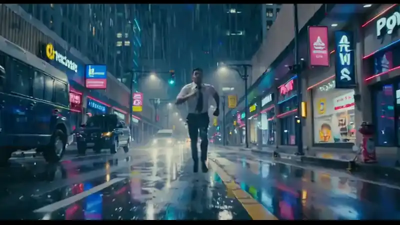

<div align="center">


<p align="center">
  <a href="LICENSE"></a>
  <a href="https://github.com/thcabq352/Agent-Slate/releases"></a>
  
  <a href="https://ko-fi.com/samwasserman"></a>
</p>

<p align="center"><strong>Agent-Slate</strong> — maintained fork by <a href="https://github.com/thcabq352">thcabq352</a> · Original <strong>Slate</strong> by <a href="https://wassermanproductions.com">Sam Wasserman</a> · Upstream: <a href="https://github.com/wassermanproductions/slate">wassermanproductions/slate</a></p>

**The prompt studio for AI filmmaking, plus a local film factory.** Plan shots, direct coverage, spot your score, cast your voices, keep continuity across an entire film — compile production-ready prompts, or generate locally with ComfyUI.

<a href="https://github.com/thcabq352/Agent-Slate/blob/main/docs/images/first-run.mp4">
  
</a>

<p><em>First run — Agent-Slate on Windows (15s). <a href="docs/images/first-run.mp4">Open MP4</a></em></p>

</div>

---

**Start here**

1. **Install** — [Windows / macOS / Linux](#install)
2. **Use** — `npm run dev` → create a project → **?** or Ctrl+/ (⌘/ on Mac)
3. **Functions & flows** — **[docs/GUIDE.md](docs/GUIDE.md)** (studio map, brain, factory, MCP)
4. **Agents in this repo** — **[AGENTS.json](AGENTS.json)**

**This fork vs [upstream Slate](https://github.com/wassermanproductions/slate)** (Sam Wasserman)

| | Upstream | Agent-Slate |
|--|----------|-------------|
| Platforms | macOS `.app` zip | Windows, macOS, Linux (from source) |
| Brain | Claude Code / Codex / local | Grok 4.5/4.6 (`grok login`), Cursor Composer, Codex, local |
| Generate | Prompts you paste into other tools | Same studio, plus optional `slate-engine` + ComfyUI |

Agent-Slate is a maintained fork of [Slate](https://github.com/wassermanproductions/slate) by Sam Wasserman. The Electron studio is the missing pre-production layer between *"I can see the shot"* and the generate button: it makes the **prompts** you paste into any generator dramatically better, faster, and consistent across a whole film. **This fork** can also run a local **film factory** (`slate-engine` + ComfyUI) so a one-line brief becomes shots and takes on disk — optional, no API keys, no bundled weights.

You write (or direct) structured, sectioned shot prompts — **Subject · Composition · Lighting · Camera · Style · Mood**, the categories a crew thinks in — with live cinematic syntax highlighting. A local AI brain helps you structure, tighten, enrich, riff, and iterate, always in the context of your film's characters, locations, props, and look. Then Agent-Slate compiles each shot, music cue, or voice for a specific target: **Seedance 2.0, Kling, Veo, Sora, Hailuo, LTX, Flux, Midjourney, GPT Image, Krea, ComfyUI, Suno, Eleven Music, Lyria, Stable Audio, ElevenLabs Voice Design, Hume, MiniMax** — each in its own dialect, against its real limits.

- 🎬 **Projects → scenes → shots.** Your film's bible (logline, world, cast, locations, props, style) travels with every prompt. The brain already knows your protagonist's scar and your city's neon.
- 🎛️ **Shot specs as real controls** — length (any seconds), fps, aspect ratio, shot size, angle, lens, movement, optional character budget. Structured fields, compiled correctly per model.
- 🖍️ **A prompt editor that reads like a lit set** — camera terms in cyan, lighting in gold, color in magenta, motion in green, mood in violet. **Picture-Lock** any line and no transform will ever touch it; **mute** a line to keep it without exporting it; highlight a phrase and **reshoot just that span**.
- 🎥 **Coverage Plans** — one scene description becomes a full set of shots: Full, Dialogue, Motion, Extreme Action, Establishing, Surveillance, Entrance, Parallel Action, Dance, Angle, Orbit, Story Beats — or call your own coverage in plain English.
- ⛓️ **Sequence Chunks** — a 3-minute fight becomes ~20-second generation prompts with explicit continuity handoffs (each chunk opens exactly where the last ended), optionally beat-directed with timecodes inside each chunk.
- 🗣️ **Director's Notes** — talk to the shot: *"make it rain, keep the neon."* The prompt updates; the old version goes to history.
- ✦ **First AD (optional)** — studio planner. Talk the film through; it writes scenes, shots, specs, prompts, cast, locations, music cues, voices — with a receipt for every action. Does not generate. Or never open it and drive everything by hand.
- 🧑‍🤝‍🧑 **Casting, Art Department, Locations, Lookbook** — structured sheets with natural-language auto-fill; one-click reference-sheet prompts pull consistent identity sheets from your image generator. Study any cinematographer, director, film, or series into a reusable style profile.
- 🎼 **A Sound Department** — design music cues like a composer spotting a scene (the brain writes tagged lyrics on request) and cast voices with audition text. **Speak with Grok** renders actual VO audio (xAI TTS → `vo/*.mp3`). Drop in **any audio file** and Agent-Slate measures it locally — tempo, pitch register, dynamics, brightness, energy arc — then reverse-engineers a matching cue or voice sheet.
- 🖼️ **References** — drop in stills or clips; clips are key-framed locally (ffmpeg) and broken down into element sheets — lensing, lighting, palette, movement — you reuse as one-click ingredients.
- 📦 **Deliverables** — per-model compile with preflight warnings (duration caps, aspect ratios, fps), smart character-budget compression that keeps locked lines verbatim, negative prompts where supported, timecode beats where honored. Copy one prompt, or export a scene as a Markdown shot list / CSV.
- 🗒️ **Takes Log & version history** — circle the take that worked; roll any prompt back.
- 🔌 **MCP built in** — the Electron control server plus **`slate-engine`** (Hermes / Cursor CLI) can plan a scene and generate local Comfy takes.
- ◆ **Agent dock** — Connect the engine, **Run brief**, compile music cues, **Factory AD**, and quality-review takes without leaving the studio.
- 🎞 **A Stills Library** — scan your dailies for circled takes (Circle Take) or any clip, extract stills with ffmpeg, and pin them to a character, location, or look. ✦ Fill then describes the person or place you actually shot, so sheets stay true to the footage.
- 🔑 **No API keys** — Grok 4.5/4.6 prefer Grok Build OAuth (`grok login`); Composer uses Cursor OAuth (`cursor-agent login`); or Codex; or a **local** model. **Grok VO** uses the same `grok login` session. Claude Code was removed (watermarked generations).

## Screenshots

Stills of the studio (the hero above is the **first run** on Windows).

| | |
|---|---|
|  |  |
|  |  |

## Install

**Windows, macOS, and Linux** — Node **20+**, then from-source setup. ffmpeg is needed for clip/audio stills (the setup script installs it when it can).

```bash
git clone https://github.com/thcabq352/Agent-Slate.git
cd Agent-Slate
```

| OS | From-source setup | Then |
|----|-------------------|------|
| **Windows** (PowerShell) | `powershell -ExecutionPolicy Bypass -File .\install.ps1 -Grok` | `npm run dev` · `grok login` |
| **macOS / Linux** | `./install.sh --grok` | `npm run dev` · `grok login` |

Same engine without the wrappers: `node scripts/setup.mjs --ffmpeg --grok` (optional `--cursor`, `--engine`).

**How it fits together** (prompts vs local generates vs brains): **[docs/GUIDE.md](docs/GUIDE.md)**. Agent rules and paths: **[AGENTS.json](AGENTS.json)**.

```bash
npm run dev          # Electron UI with hot reload
# optional:
# cargo build -p slate-engine
# npm run build && npm run package:desktop [--install]
```

`--install` after `package:desktop`: Windows Start Menu (`%LOCALAPPDATA%\Programs\Agent-Slate`), macOS `/Applications/Agent-Slate.app`, Linux `~/.local/opt/agent-slate` + `~/.local/bin/agent-slate`.

Upstream Slate (original macOS `.app` zip, not this fork):  
`curl -fsSL https://raw.githubusercontent.com/wassermanproductions/slate/main/install.sh | bash`

### The brain — your subscription or a local model, no API keys

Agent-Slate contains no API keys and makes no cloud calls of its own. Pick a brain per project:

- **Cursor (Composer)** (recommended default) — install [Cursor CLI](https://cursor.com/docs/cli/installation), then `cursor-agent login` (browser OAuth). Uses Composer (`composer-2.5` / `composer-2.5-fast`), not Claude.
- **Grok 4.5 / Grok 4.6** — prefer official Grok Build (`grok` CLI + `grok login`). Windows: `irm https://x.ai/cli/install.ps1 | iex`. macOS/Linux: `curl -fsSL https://x.ai/cli/install.sh | bash`. If that session is missing, Agent-Slate falls back to Cursor OAuth (`cursor-grok-4.5-*` / `cursor-grok-4.6-*` via `cursor-agent`). Composer always stays on Cursor.
- **Codex** — if the ChatGPT desktop app is installed and signed in, Agent-Slate uses its bundled codex automatically; otherwise install the codex CLI and `codex login`
- **Local model (offline)** — any OpenAI-compatible local server: **Ollama, LM Studio, vLLM, llama.cpp, KoboldCpp, Jan**, and friends. Agent-Slate auto-detects the common ports (`11434`, `1234`, `8000`, `8080`), lists whatever models you have loaded, and never sends a byte off your machine. A custom endpoint field covers anything else. For the reference image/video breakdown features, load a vision-capable model (e.g. `llama3.2-vision`, `qwen2.5-vl`).

Pick the brain per project in the Project Bible. Click the **brain pill** in the titlebar any time to run a live connectivity test — if something's wrong it tells you the exact fix. If no brain is present, everything except the agent features still works.

## The workflow

See **[docs/GUIDE.md](docs/GUIDE.md)** for diagrams. Short version:

1. **Create a project** and fill the **Project Bible** — logline, world & tone, defaults (aspect ratio, clip length, target model, brain).
2. **Cast and scout** in Studios, or skip to **Coverage** / **✦ First AD**.
3. **Craft the prompt** in the editor (transforms, lock, mute), then **Deliver** — compile and copy for your generator.
4. Optional: **◆ Agent** + Comfy for local takes; **Speak with Grok** for VO audio.

Projects are plain JSON in `~/Documents/Slate/` (Windows: `%USERPROFILE%\Documents\Slate`).

## Working with agents (MCP)

Agent-Slate ships a [Model Context Protocol](https://modelcontextprotocol.io) server so agents and suite apps can read and write your projects while Agent-Slate runs:

```bash
# ~/.cursor/mcp.json  (Windows: %USERPROFILE%\.cursor\mcp.json)
# Electron must be running
# { "mcpServers": { "slate": { "command": "node", "args": ["/absolute/path/to/Agent-Slate/mcp/slate-mcp.mjs"] } } }
```

Tools: `list_projects`, `get_project`, `create_project`, `list_shots`, `get_shot_prompt`, `set_shot_prompt` (with automatic versioning), `add_scene`, `list_characters`, `list_locations`, `list_lookbook`. The Electron control channel is localhost-only with a per-session bearer token in `electron-control.json` (not the engine’s `engine-control.json`). The bridge is a single zero-dependency file.

It pairs naturally with the rest of [Wasserman's Filmmaker Suite](https://github.com/wassermanproductions/wassermans-filmmaker-suite) — break down the script in ScriptBreak, block the scene in Blockout, and craft every generator prompt in Agent-Slate.

## Rust engine / Hermes (film factory)

**V1 is shipped** — see [`docs/STATUS.md`](docs/STATUS.md). `slate-engine` plans a one-scene shoot (4–8 shots), writes prompts, runs a local Comfy pack, and quality-gates stills with Ollama VL.

| Pack | Live? |
|------|--------|
| `default-still` | Flux.1-dev fp8 |
| `default-video` | LTX 2.3 distilled T2V (768×432, 49 frames; one-clip smoke 92s / 356 KB on this host) |
| `default-i2v` | LTX I2V from a Flux keyframe or provided still |
| `default-flf2v` | LTX first + last frame |

**Build & run**

```bash
cargo build -p slate-engine                 # dock auto-spawns debug or release
cargo run -p slate-engine -- mcp            # Hermes / Cursor CLI
cargo run -p slate-engine -- serve          # Electron ◆ Agent → Connect
```

Binary: `slate-engine` (`target/debug` or `target/release`). Rebuild after engine changes.

**ComfyUI** — `http://127.0.0.1:8188`. One GPU owner only; do not stack Video Buddy heavy jobs with Agent-Slate generations.

**Vision judge** — preferred **`qwen3.5:9b`** (not bundled): `ollama pull qwen3.5:9b`. Override `SLATE_JUDGE_MODEL` / `SLATE_JUDGE_ENDPOINT`.

**Hermes** must call **blocking** `slate_film_factory` (no `background: true`) with timeout **1800s** (900s minimum):

```bash
hermes mcp add slate -- /absolute/path/to/target/debug/slate-engine mcp
```

The Electron **Run brief** button uses `background: true` and polls `slate_status`. **Assemble cut** writes `{project}/cut/slate_cut.mp4`. Cancel interrupts Comfy (`POST /interrupt`). Video takes are judged from the first ffmpeg frame.

**Dry-run:** `SLATE_DRY_RUN=1 cargo run -p slate-engine -- mcp`

**Share the skill (Hermes Skills Hub):** tap `thcabq352/Agent-Slate` then `hermes skills install slate-film-factory -y --category media`. Zip: [`share/slate-film-factory.zip`](share/slate-film-factory.zip) (`npm run share:skill`). MCP: `hermes mcp add slate -- <slate-engine> mcp` (timeout 1800s). See [`skills/slate-film-factory/INSTALL.md`](skills/slate-film-factory/INSTALL.md).

Skill source: [`skills/slate-film-factory/SKILL.md`](skills/slate-film-factory/SKILL.md). Operator manual: [`docs/engine.md`](docs/engine.md). Original design: [spec](docs/superpowers/specs/2026-08-11-slate-rust-agent-film-factory-design.md) · [plan](docs/superpowers/plans/2026-08-12-slate-rust-film-factory.md).

## Development

| Command | What it does |
|---|---|
| `npm run dev` | Run from source with hot reload |
| `npm run build` | Production build (electron-vite) |
| `npm test` | Unit tests (export engine, action engine, audio DSP) |
| `cargo test --workspace` | Rust domain / brain / Comfy / engine tests |
| `npm run typecheck` | Strict TypeScript across main, preload, renderer |
| `npm run setup` / `install.ps1` / `install.sh` | From-source setup (ffmpeg; add `--grok` / `-Grok`) |
| `npm run package:desktop` | Unpacked app in `dist/` (Windows, macOS, Linux) |
| `npm run share:skill` | Zip `skills/slate-film-factory/` → `share/slate-film-factory.zip` |
| `node scripts/package-macos.mjs --install` | macOS only: `/Applications/Agent-Slate.app` |
| `node scripts/snap.mjs` | Regenerate README screenshots headlessly |

Stack: Electron + TypeScript + React, CodeMirror 6 editor, zustand state, vitest. The audio reference analysis is local DSP (tempo, pitch, dynamics, structure) — measured on your machine, nothing uploaded.

## Support

**Agent-Slate** — issues and PRs: [github.com/thcabq352/Agent-Slate](https://github.com/thcabq352/Agent-Slate/issues). Maintainer: [thcabq352](https://github.com/thcabq352).

**Upstream author** — optional tips for Sam Wasserman’s open-source work (no pressure):

- [GitHub Sponsors](https://github.com/sponsors/wassermanproductions)
- [Ko-fi](https://ko-fi.com/samwasserman)

## License & credits

**Apache License 2.0** — see [LICENSE](LICENSE). Use, modify, fork, and redistribute, commercially or otherwise, under those terms.

**Attribution required (Apache-2.0 §4(d)):** retain [NOTICE](NOTICE) and credit the original author **Sam Wasserman** ([wassermanproductions.com](https://wassermanproductions.com)) in documentation and any about/credits surface. Full compliance notes: [docs/ATTRIBUTION.md](docs/ATTRIBUTION.md) · [MAINTAINERS.md](MAINTAINERS.md).

| Role | Who |
|------|-----|
| **Created by** | **Sam Wasserman** — [wassermanproductions.com](https://wassermanproductions.com) · [wasserman.ai](https://wasserman.ai) · upstream [wassermanproductions/slate](https://github.com/wassermanproductions/slate) |
| **Maintainer (Agent-Slate)** | **thcabq352** — [github.com/thcabq352](https://github.com/thcabq352) · [thcabq352/Agent-Slate](https://github.com/thcabq352/Agent-Slate) |

Fork-specific changes: [docs/CHANGELOG-FORK.md](docs/CHANGELOG-FORK.md).
