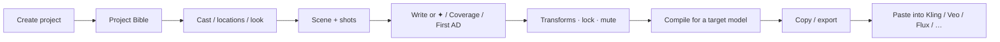
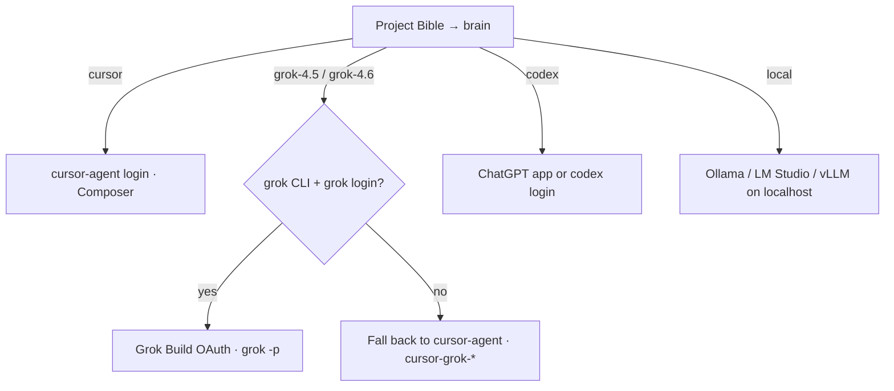
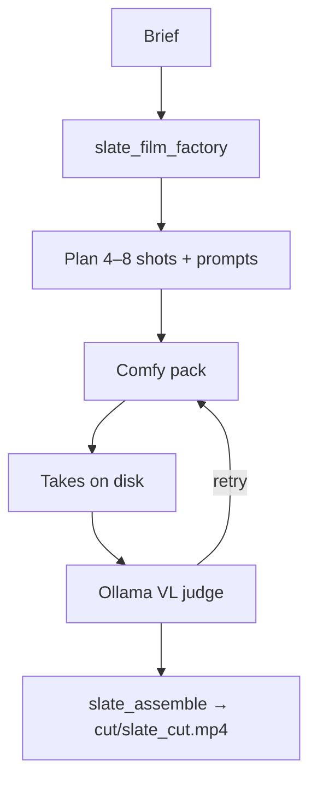

# Guide — install, use, functions, and flows

**v0.3.2 · 2026-08-13.** One map for **humans** and **agents**. Product name: **Agent-Slate**. Technical IDs stay `slate-*` (see [AGENTS.json](../AGENTS.json)).

This is the maintained fork of Sam Wasserman's [Slate](https://github.com/wassermanproductions/slate). Upstream is macOS + Claude Code and prompt-only. Agent-Slate adds Windows / Linux, Grok 4.5/4.6 + Cursor Composer brains, and an optional ComfyUI factory.

| You want | Go here |
|----------|---------|
| Install on Windows / macOS / Linux | [Install](#install) |
| What to click in the app | [Studio map](#studio-map) |
| How a shot prompt is made | [Studio flow](#studio-flow-prompts) |
| How local video/stills are generated | [Factory flow](#factory-flow-optional) |
| Which brain / login | [Brain flow](#brain-flow) |
| Agent / MCP rules | [AGENTS.json](../AGENTS.json) |
| What is shipped | [STATUS.md](STATUS.md) |

In the running app, **?** or **Ctrl+/** (macOS **⌘/**) opens the same tour.

---

## Install

Three layers. You can stop after layer 1.

| Layer | What you get | Need |
|-------|----------------|------|
| **1. Studio** | Plan shots, compile prompts, copy to any generator | Node 20+, `npm run dev` |
| **2. Brain** | ✦ Fill, Coverage, First AD, transforms, Grok VO | `grok login` and/or `cursor-agent login`, or a local model |
| **3. Factory** | Brief → Comfy takes on disk | Rust `slate-engine`, ComfyUI `:8188`, ffmpeg |

```bash
git clone https://github.com/thcabq352/Agent-Slate.git
cd Agent-Slate
```

| OS | Command | Then |
|----|---------|------|
| **Windows** (PowerShell) | `powershell -ExecutionPolicy Bypass -File .\install.ps1 -Grok` | `npm run dev` · `grok login` |
| **macOS / Linux** | `./install.sh --grok` | `npm run dev` · `grok login` |

Add `-Engine` / `--engine` to also `cargo build -p slate-engine`. Add `-Cursor` / `--cursor` for Composer via Cursor CLI.

Same Node entry on every OS: `node scripts/setup.mjs --ffmpeg --grok`.

Unpacked desktop app: `npm run build` then `npm run package:desktop` (optional `--install`).

**ffmpeg** (stills, VO mux, factory judge/assemble): Windows `winget install Gyan.FFmpeg` · macOS `brew install ffmpeg` · Linux `sudo apt install ffmpeg`.

Projects live in `~/Documents/Slate/` (Windows: `%USERPROFILE%\Documents\Slate`). Override with `SLATE_DATA_DIR`.

---

## Studio map

```
┌─────────────────────────────────────────────────────────────┐
│  ◆ Agent-Slate     ? Help     Brain: … — test               │
│                    ✦ First AD     ◆ Agent     Close Project │
├──────────┬──────────────────────────────┬───────────────────┤
│ Scenes / │ Shot prompt editor           │ Setups            │
│ shots    │ Specs · transforms · compile │ Coverage          │
│ Bible    │                              │ Studios (cast…)   │
│          │                              │ Refs · Deliver    │
└──────────┴──────────────────────────────┴───────────────────┘
         ✦ First AD drawer          ◆ Agent dock (factory)
```

| Control | Function |
|---------|----------|
| **?** / Help shortcut | This tour in-app |
| **Brain pill** | Tiny live call; failure text is the fix |
| **✦ First AD** | Studio planner — scenes, shots, bible, prompts. **Does not generate media.** |
| **◆ Agent** | Factory dock — Connect engine, Run brief, Factory AD, judge, assemble |
| Left rail | Scenes, shots, Project Bible (brain + defaults) |
| Center | Prompt editor + shot specs + compile |
| Right rail | Setups, Coverage, Studios, Refs, Deliver |

Two ADs are **different chats**. Do not treat them as one.

---

## Studio flow (prompts)

This is the default product: better prompts, no Comfy required.



1. **Create a project** on Home.
2. **Project Bible** (left rail, bottom) — logline, world, aspect, duration, **brain**, target model.
3. **Studios** — characters, props, locations, lookbook. ✦ Fill from one line.
4. **Shots** — hand-write, **Coverage** (one description → a set of shots), or **✦ First AD**.
5. **Craft** — Structure / Tighten / Enrich / Distill / Shot / Angle; Picture-Lock lines; mute; pickup a span.
6. **Deliver** — pick the generator, heed preflight, **Prompt →** copy. Circle takes that worked.

Continuity Check (Coverage / scene tools) is a script-supervisor pass on wardrobe, light, weather, geography — it does not render video.

---

## Brain flow

No API keys in Agent-Slate. Billing is your existing Grok / Cursor / ChatGPT / local server.



| Pick | Login | Used for |
|------|-------|----------|
| Cursor (Composer) | `cursor-agent login` | Default brain |
| Grok 4.5 / 4.6 | **`grok login` first** | Brain + **Speak with Grok** VO |
| Codex | ChatGPT desktop or `codex login` | Brain |
| Local model | none | Offline brain; vision model for stills breakdown |

Never spawn a binary named `agent` — Grok and Cursor both ship that name. Use `grok` / `grok.exe` or `cursor-agent`.

VO: **Studios → Sound → Voices** → **Speak with Grok** → `{project}/vo/*.mp3`. Same `grok login` session. **Prompt →** on a voice sheet still compiles ElevenLabs / Hume / MiniMax paste-ins only.

---

## Factory flow (optional)

Local media. Needs `slate-engine` + Comfy at `http://127.0.0.1:8188`. One GPU owner.



| Front | How | `slate_film_factory` |
|-------|-----|----------------------|
| **◆ Agent dock** | Connect / start engine (`serve`) | `{ background: true }` then poll `slate_status` |
| **Hermes / CLI agent** | `slate-engine mcp` | **Blocking** — never `background: true`. Timeout **1800s** |

| Pack | Result |
|------|--------|
| `default-still` | Flux stills (best first factory) |
| `default-video` | LTX T2V short clip |
| `default-i2v` | Flux keyframe (or still) → LTX I2V |
| `default-flf2v` | First + last frame → LTX |

**Factory AD** in the dock (`slate_first_ad`) is the engine operator: continuity book + scene plan for generates. It is not ✦ First AD.

Control files (do not mix):

| Writer | File | `app` |
|--------|------|-------|
| Electron | `electron-control.json` | `slate-electron` |
| `slate-engine serve` | `engine-control.json` | `slate-engine` |

Windows: `%APPDATA%\slate\`. macOS/Linux: `~/.config/slate/`. Leftover `control.json` is unused.

Dry-run (plan only): `SLATE_DRY_RUN=1`.

---

## MCP — two servers

| Server | When | Tools (examples) |
|--------|------|------------------|
| **Studio** `mcp/slate-mcp.mjs` | Electron **must be running** | `list_projects`, `get_project`, `set_shot_prompt`, … |
| **Factory** `slate-engine mcp` | Engine binary, Comfy optional | `slate_health`, `slate_film_factory`, `slate_first_ad`, `slate_assemble`, … |

Studio MCP config: `~/.cursor/mcp.json` (Windows `%USERPROFILE%\.cursor\mcp.json`), `command: node`, `args: [absolute path to slate-mcp.mjs]`.

---

## Function cheat sheet

### Humans (studio)

| Job | Where |
|-----|--------|
| New film | Home → Create Project |
| World + brain | Left rail → Project Bible |
| Cast / place / look | Right → Studios |
| Layout a scene | Right → Coverage, or ✦ First AD |
| Write the prompt | Center editor |
| Match a generator | Right → Deliver → compile / copy |
| Speak a line | Studios → Sound → Voices → Speak with Grok |
| Local takes | ◆ Agent → Connect → Run brief |
| Help | **?** or Ctrl+/ / ⌘/ |

### Agents (factory tools)

| Tool | Function |
|------|----------|
| `slate_health` | Comfy, brain, ffmpeg, packs, VL |
| `slate_film_factory` | Brief → project + generates |
| `slate_generate_shot` | One shot retry |
| `slate_judge_take` | VL quality gate |
| `slate_first_ad` | Factory AD chat |
| `slate_circle_take` | Mark a take circled (`Approve` in the dock) |
| `slate_assemble` | Concat takes → `cut/slate_cut.mp4` |
| `slate_cancel` | Stop job + Comfy `/interrupt` |
| `slate_status` | Poll background factory |
| `slate_compile_music` | Cue **text** only (no audio file) |
| `slate_list_packs` / `slate_run_pack` | Pack inventory / one graph |

---

## Docs

| File | Audience |
|------|----------|
| [README.md](../README.md) | Humans: what it is + install · first-run clip |
| [GUIDE.md](GUIDE.md) | This file — functions and flows |
| [AGENTS.json](../AGENTS.json) | Coding agents in this repo |
| [STATUS.md](STATUS.md) | Shipped factory snapshot |
| [engine.md](engine.md) | Factory operator detail |
| [CHANGELOG-FORK.md](CHANGELOG-FORK.md) | Fork delta vs Wasserman Slate |
| [ATTRIBUTION.md](ATTRIBUTION.md) | Apache-2.0 credit |
| [skills/slate-film-factory/SKILL.md](../skills/slate-film-factory/SKILL.md) | Hermes Skills Hub factory skill |
| [workflows/packs/README.md](../workflows/packs/README.md) | Comfy packs (no weights) |
| [prompting-research.md](prompting-research.md) | Studio Deliver profiles (Seedance / MiniMax / FLUX) |
